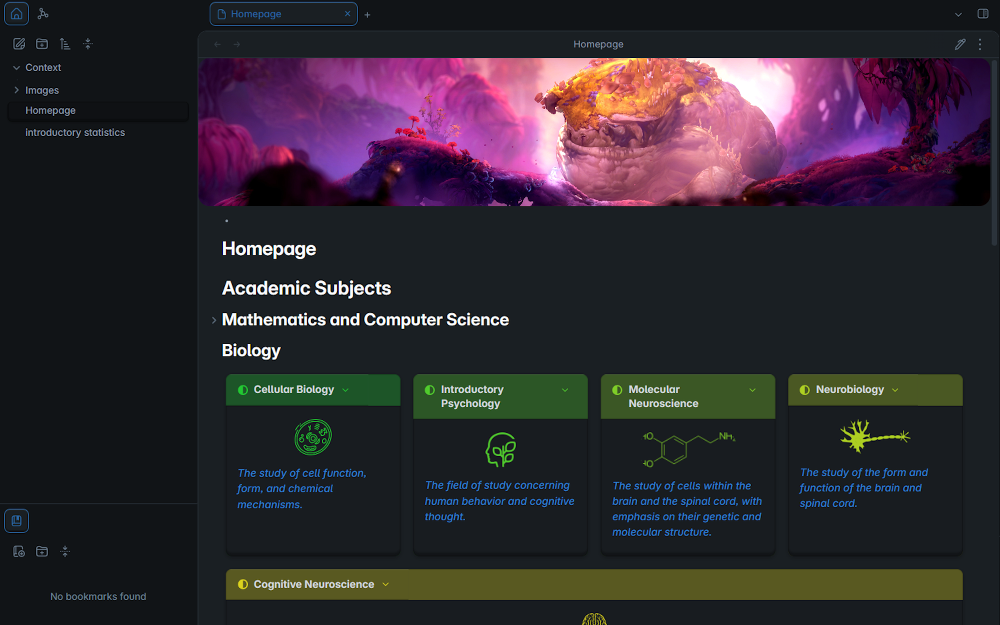

# Obsidian School Dashboard Template 📚✨

Welcome to the **Obsidian School Dashboard Template**! This template is designed to streamline your school life by keeping all your notes, assignments, schedules, and resources organized in one place. Whether you're a high school student, college student, or lifelong learner, this dashboard is crafted to help you stay on top of your academic responsibilities while maximizing productivity in Obsidian.

## 🎯 Features

### 1. **Daily Planner**

- **(WIP) Assignments**: Quickly log your assignments, deadlines, and priorities. Track your progress easily, so nothing slips through the cracks.
- **(WIP) Tasks**: Organize daily to-dos, including academic tasks and personal goals, with easy checklists and tags for quick reference.
- **Events & Reminders**: Schedule exams, study sessions, group meetings, and important deadlines in a dedicated calendar view.

### 2. **Class Notes Organizer**

- **Linked Notes**: Easily connect related notes, allowing you to navigate between topics and subjects smoothly. Perfect for building a web of interconnected ideas.
- **(WIP) Templates for Quick Capture**: Pre-made note templates for different types of classes, lectures, and labs for consistent and quick note-taking.

### 3. **(WIP) Study & Revision Tools**

- **Flashcards**: Create embedded flashcards for quick revision, perfect for reviewing key concepts before exams.
- **Mind Map Templates**: Organize ideas visually with mind maps to help retain and recall complex information.
- **Reading List & Resources Tracker**: Manage all your academic resources—books, articles, videos—so you can easily return to them during study sessions.

## 📋 Installation

1. **Download the Template Files**: Clone this repository or download the zip file, and extract it to your preferred directory.
2. **Import into Obsidian**: Open Obsidian, and add this folder as a new vault.
3. **Optional Setup**: Customize the dashboard to suit your needs! Add your own subjects, modify note templates, and personalize the look and feel.

## 🖌 Customization Tips

- **Personalize Note Templates**: Add your preferred headings and fields to the templates for each subject.
- **Use Obsidian Plugins**: Enhance the dashboard with plugins like Calendar, Kanban, or Dataview for even more functionality!

## 💡 Usage Tips

- **Make It a Habit**: Regularly update your dashboard at the start of each week or day to keep track of assignments and deadlines.
- **Link Liberally**: Use links to connect notes across subjects, assignments, and projects for an interconnected view of your studies.
- **Reflect Often**: Take advantage of the journal and review sections to stay grounded and mindful of your academic progress.

## 🛠️ Dependencies

This template leverages Obsidian's community plugins for enhanced functionality:

- **Admonition**: Adds visually distinct blocks to your notes, perfect for highlighting important details, reminders, or study tips.
- **Google Calendar**: Sync your academic calendar with Obsidian, allowing you to view and manage events and deadlines directly within your dashboard.
- **Hider**: Customize the interface by hiding unnecessary elements in Obsidian for a clean, distraction-free workspace.
- **Homepage**: Set a personalized landing page that greets you upon opening your vault, giving you quick access to daily tasks, assignments, and more.
- **MAKE.Md**: Organize your notes with advanced folder management and linking capabilities, helping you keep all your subjects and topics neatly arranged.

> **Note**: Be sure to install and enable these plugins and configure Google Calendar in your Obsidian settings for the full experience.

## 🎉 Get Started

Simply start by adding your subjects, class schedules, and current assignments. As you fill out the dashboard, you’ll quickly have a one-stop workspace for managing every aspect of your school life.

Happy Studying! 🎓
